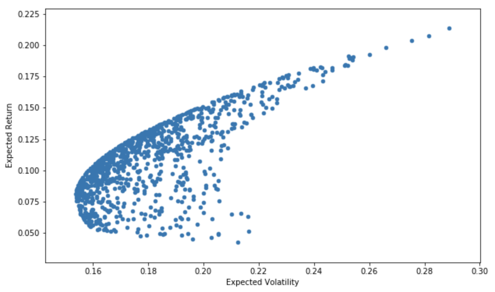

<!-- PROJECT SHIELDS -->

[![Contributors][contributors-shield]]()
[![LinkedIn][linkedin-shield]][linkedin-url]

<!-- PROJECT LOGO -->
 

  <h3 align="center">Efficient Frontier</h3>

  

    Python program that graphs the efficient frontier of a multi-asset portfolio.
  

## About The Project

A python program that graphs the efficient frontier of a multi-asset portfolio. The demonstrated graph was done for Walmart, Facebook, and British Petroleum ('WMT, 'FB', 'BP). 

<!-- Markdown link & img dfn's -->

[contributors-shield]: https://img.shields.io/badge/contributors-1-orange.svg?style=flat-square
[linkedin-shield]: https://img.shields.io/badge/-LinkedIn-black.svg?style=flat-square&logo=linkedin&colorB=555
[linkedin-url]: https://linkedin.com/in/rsokz
